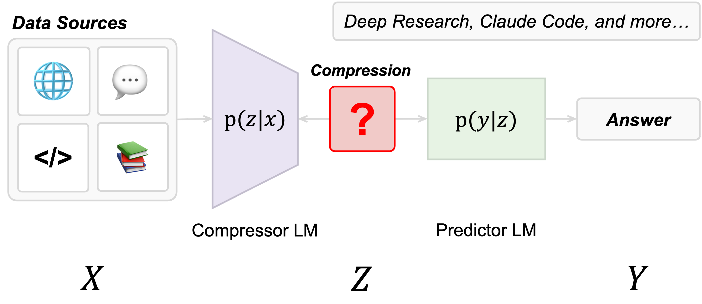

# An Information Theoretic Perspective on Agentic System Design

<p align="center">
  
  
  <a href="https://arxiv.org/abs/xxxx.xxxxx"></a>
</p>

<p align="center">
  This repository contains code for the following paper:
</p>

<blockquote align="center">
  <b>An Information Theoretic Perspective on Agentic System Design</b><br/>
  Shizhe He, Avanika Narayan, Ishan S. Khare, Scott Linderman, Christopher Ré, Dan Biderman.<br/>
  <small><a href="https://arxiv.org/abs/..."><em>[Read the paper]</em></a></small>
</blockquote>

<div style="margin-top: 0.75em;"></div>

**tl;dr** We show how to design agentic systems more efficiently by scaling compressors instead of predictors. Through information-theoretic analysis, we find that larger compressors produce more concise outputs while carrying 5.4x more mutual information—scaling almost "for free" computationally. By front-loading compute into local compressors rather than expensive cloud predictors, we achieve 102% of frontier performance at only 28% of the cost (see our [blogpost](https://hazyresearch.stanford.edu/blog/...) for more).

## Table of Contents

- [Code Structure](#code-structure)
- [Setup](#setup)
- [Information Bottleneck Framework](#information-bottleneck-framework)
- [Deep Research System](#deep-research-system)
- [Citation](#citation)


## Code Structure

The code is organized as follows:

- [src/ib/](src/ib/): contains the main Information Bottleneck framework:
  - [src/ib/pipeline/](src/ib/pipeline/): compression and prediction pipelines with dataset-specific protocols
  - [src/ib/clients/](src/ib/clients/): unified model client interfaces (OpenAI, SGLang, Anthropic, Fireworks, SGLangModal)
  - [src/ib/metrics/](src/ib/metrics/): mutual information estimation (Monte Carlo)
  - [src/ib/tasks/](src/ib/tasks/): dataset loaders and task definitions (FineWeb, WildChat, LongHealth, FinanceBench)
  - [src/ib/generate.py](src/ib/generate.py): main generation pipeline runner
- [src/deepresearch/](src/deepresearch/): contains the ResSwarm multi-agent research system:
  - [src/deepresearch/res_swarm/](src/deepresearch/res_swarm/): core ResSwarm implementation with predictor-compressor architecture
  - [src/deepresearch/run_full_experiment.py](src/deepresearch/run_full_experiment.py): main experiment runner for research tasks
  - [src/deepresearch/convert_to_race_format_all_runs.py](src/deepresearch/convert_to_race_format_all_runs.py): results conversion for evaluation
- [src/serve_modal.py](src/serve_modal.py): Modal deployment script for SGLang model serving
- [data/](data/): processed datasets and cache files for FineWeb and WildChat
- [results/](results/): paper figures and experimental outputs

---

## Setup

**Step 1:** Clone the repository and install the Python package.

```bash
# Clone the repository
git clone https://github.com/HazyResearch/agentic-information-bottleneck.git
cd agentic-information-bottleneck

# Install package
pip install -e .

# Install experiment dependencies (optional)
pip install -e ".[experiments]"
```

**Step 2:** Set environment variables

```bash
export HF_TOKEN="your-huggingface-token"
export OPENAI_API_KEY="your-openai-key"
export FIREWORKS_API_KEY="your-fireworks-key"
# and other cloud models you would like to call
```

**Step 3:** Deploy models on Modal (optional)

```bash
# Custom model deployment
MODEL_PATH="Qwen/Qwen2.5-7B-Instruct" modal run src/serve_modal.py

# Custom GPU configuration for persistent service
GPU_TYPE="h100" GPU_COUNT=4 modal deploy src/serve_modal.py
```

> **Note on Modal Infrastructure:** We used Modal to run our inference workloads when running our scaling analysis. Since containers on Modal start up quite quickly, it's practical to scale out horizontally to several dozen GPUs for very short bursts. We provide deployment scripts in [src/serve_modal.py](src/serve_modal.py) for inference servers on Modal.

## Information Bottleneck Framework

We model compressor-predictor pipelines as information bottleneck systems:

<p align="center">
  
</p>

Where:
- **X**: Original input context or document
- **Z**: Compressed representation from small compressor
- **Y**: Final prediction from large predictor

This is implemented in `src/ib/` with the following components:

### Core Components

- **`pipeline/`** - Compression and prediction pipelines with dataset-specific protocols
  - `CompressionPredictionProtocol` - Main two-stage compression-prediction pipeline for LongHealth and FinanceBench
  - `WildchatCompressionProtocol` - Specialized for conversational data in WildChat dataset
  - `FinewebCompressionProtocol` - Specialized for document-based tasks in FineWeb dataset

- **`clients/`** - Unified model interfaces supporting multiple providers
  - OpenAI, Fireworks, SGLangModal (remote)
  - SGLang, Ollama (local)
  - Usage tracking and cost monitoring

- **`metrics/`** - Mutual information estimation
  - Monte Carlo estimators using sampling
  - Proxy-LM estimators for black-box models
  - Rate-distortion analysis tools
 
- **`tasks/`** - Dataset loaders and evaluation frameworks
  - FineWeb document QA tasks
  - WildChat conversational tasks
  - LongHealth domain-specific tasks
  - FinanceBench tasks

### Example Usage

```python
from src.ib.pipeline.compression_prediction import CompressionPredictionProtocol
from src.ib.clients import ClientConfig

# Configure compression-prediction pipeline
config = CompressionPredictionProtocol.Config(
    predictor_client=ClientConfig(model_name="gpt-4o"),
    compressor_client=ClientConfig(model_name="llama-3.1-8b-instruct"),
    num_samples=3,
    worker_temperature=0.6
)

protocol = CompressionPredictionProtocol(config)
response = protocol(id="example", query="question", context=[document])
```

## Deep Research System

Our Deep Research framework (`src/deepresearch/`) provides multi-agent research orchestration capabilities. For detailed setup and usage instructions, see the dedicated [Deep Research README](src/deepresearch/README.md).


**Quick Summary:**
- Compressor-Predictor architecture for AI research tasks
- Integrated search infrastructure (SerpAPI + Jina Reader)
- DeepResearch Bench evaluation integration
- Support for mixed cloud/local LLM configurations

## Citation

If you find our work useful, please cite:

```bibtex
@article{he2025informationtheoreticperspectiveagentic,
  title={An Information Theoretic Perspective on Agentic System Design},
  author={He, Shizhe and Narayan, Avanika and Khare, Ishan S. and Linderman, Scott and Ré, Christopher and Biderman, Dan},
  journal={arXiv preprint arXiv:2512.21720},
  year={2025}
}
```
